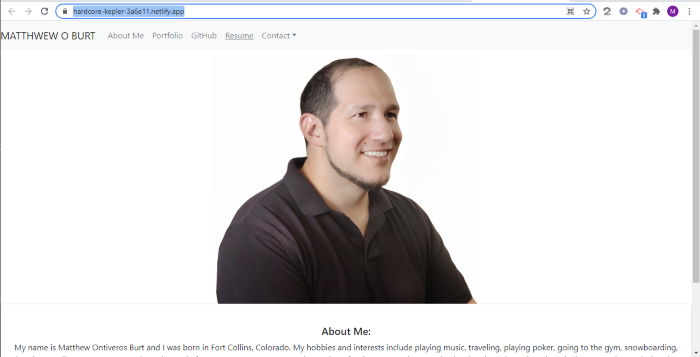

# React-Portfolio
This portfolio is a React application that displays my most recent projects and displays my most recently learned skills.

## Built With:
* React
* Reactstrap
* Node.JS
* JSX
* Deployed on Netlify

## Construction of the application: 
Basically I use react to conditionaly render multiple states on the same page.  I created components for each of the areas that I wanted to conditionallay rendred and each was called in the App.js file.  I also used hoots for 'onclick" events so when the user clicked the corresponding render would occur. The componets I created were the "AboutMe", "Footer","Forms", "Background", and Nav. 

[React Portfolio](https://hardcore-kepler-3a6e11.netlify.app/)
